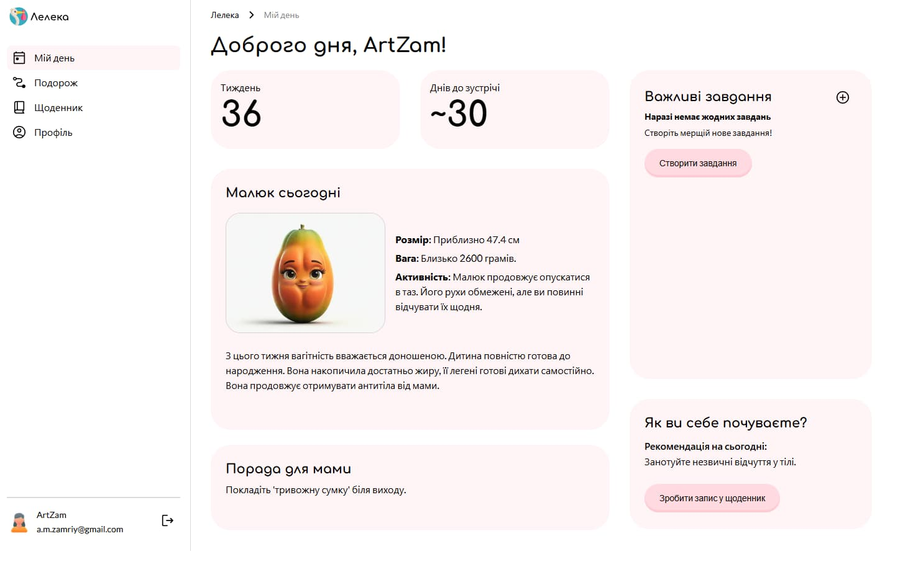
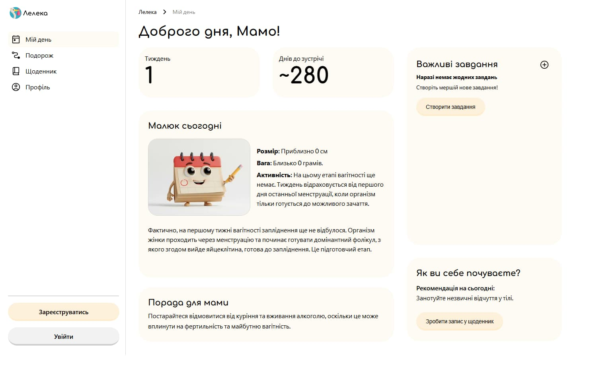
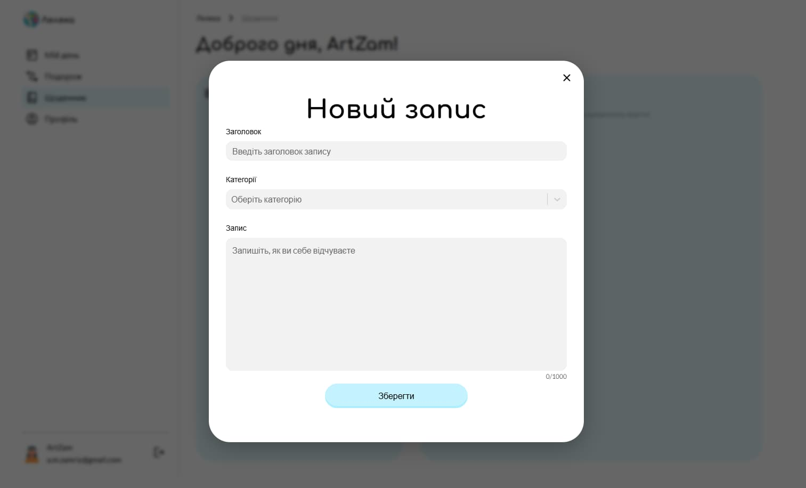

# 🕊️ Leleka — Pregnancy Tracker (Frontend)


---

## 📌 About

**Leleka** is a modern web application designed for expecting mothers.

It helps users:

- track pregnancy progress
- monitor baby development week by week
- manage daily tasks
- keep a personal diary

---

## ✨ Features

- 🔐 Authentication (Register / Login / Logout)
- 📊 Dashboard with real-time pregnancy data
- 👶 Weekly baby development insights
- 📔 Personal diary (CRUD)
- ✅ Task management with status updates
- 👤 Profile editing and avatar upload

---

## 🖼️ Screenshots/DEMO

### Themes

<p align="center">
  
  
</p>

### Diary Modal

<p align="center">
  
</p>

---

## 🛠️ Tech Stack

- **Framework:** Next.js (App Router)
- **Language:** TypeScript
- **State Management:** Zustand
- **Data Fetching:** React Query
- **Forms:** Formik + Yup
- **Styling:** CSS Modules

---

## 📂 Project Structure

```
app/
components/
hooks/
lib/
styles/
public/
```

---

## ⚙️ Getting Started

```bash
npm install
npm run dev
```

Open in browser:

```
http://localhost:3000
```

---

## 🔗 Backend Repository

👉 https://github.com/Valentyna877/project-1_back

---

## 👥 Team

GOIT Final Team Project
